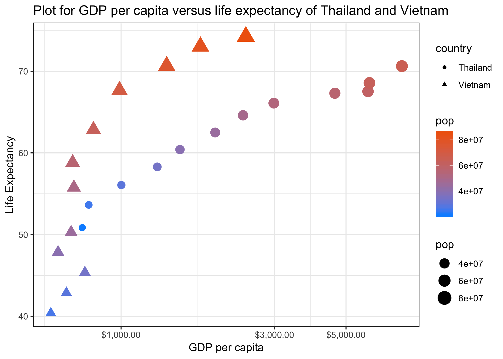

## Initial Setup
The data I am using in this assignment is the `gapminder` dataset.
```{r}
# Load the packages needed
# install.packages("prettydoc")
suppressPackageStartupMessages(library(prettydoc))
suppressPackageStartupMessages(library(tidyverse))
suppressPackageStartupMessages(library(gapminder))
suppressPackageStartupMessages(library(forcats))
suppressPackageStartupMessages(library(ggthemes))
suppressPackageStartupMessages(library(kableExtra))
suppressPackageStartupMessages(library(gridExtra))
suppressPackageStartupMessages(library(grid))
suppressPackageStartupMessages(library(scales))
suppressPackageStartupMessages(library(plotly))
# Source: https://github.com/dgrtwo/gganimate
# install.packages("cowplot")  # a gganimate dependency
# devtools::install_github("dgrtwo/gganimate")
# suppressPackageStartupMessages(library(gganimate))
```


## Part 1: Factor Management

### Drop Oceania

**_Task Description_**: _Filter the Gapminder data to remove observations associated with the continent of Oceania. Additionally, remove unused factor levels. Provide concrete information on the data before and after removing these rows and Oceania; address the number of rows and the levels of the affected factors._

Before making any changes to the dataset, let us review the dimension and structure of the original dataset. Note that `gapminder` dataset has 1704 rows and 6 columns, among which the continent Oceania has 24 observations. 

```{r}
# Review on the dimension and structure of the original dataset
dim(gapminder)
# check the continent counts
continent_tbl <- as.data.frame(table(gapminder$continent))

# make the table of the continent counts  
continent_tbl%>%
  kable("html", caption = "Continent Counts",col.names = c("Continent", "Counts")) %>%
  kable_styling(bootstrap_options = c("striped", "hover", "condensed"),full_width = F)%>%
  column_spec(1, bold = T, border_right = T) %>%
  column_spec(2, width = "20em")
```

After checking out the original dataset, I first filtered the dataset to remove the observations associated with the continent of Oceania. The function `levels()` provides access to the levels attribute of a variable. Using this function, we can see that the level "Oceania" is still in the attribute of the variable, which means, only by removing the observations the level is not dropped from the original dataset. 

The function `droplevels()` is used to drop unused levels from a factor or, more commonly, from factors in a data frame. Here I use this function to drop the level "Oceania" which is no longer in the filtered dataset. 

```{r}
# Filter the data to remove the observations from Oceania
new_dat <- gapminder %>%
  filter(continent!="Oceania")

# access the levels attribute of the variable continent
levels(new_dat$continent)

# manually drop the level
new_dat_drop <- new_dat %>%
  droplevels()

# access the levels attribute of the variable continent after dropping unused levels
levels(new_dat_drop$continent)
```

From the table of continent counts for the two cases we can see that, just by removing the observations associated with one level, R will make the observation counts for the corresponding level zero but keep the level unchanged.

```{r, echo= FALSE}
continent_tbl_new <- as.data.frame(table(new_dat$continent))
continent_tbl_new%>%
  kable("html", caption = "Continent Counts after removing the observations from `Oceania`",col.names = c("Continent", "Counts")) %>%
  kable_styling(bootstrap_options = c("striped", "hover", "condensed"),full_width = F)%>%
  column_spec(1, bold = T, border_right = T) %>%
  column_spec(2, width = "20em")

```

```{r, echo = FALSE}
continent_tbl_drop <- as.data.frame(table(new_dat_drop$continent))
continent_tbl_drop%>%
  kable("html", caption = "Continent Counts after dropping the `Oceania` level",col.names = c("Continent", "Counts")) %>%
  kable_styling(bootstrap_options = c("striped", "hover", "condensed"),full_width = F)%>%
  column_spec(1, bold = T, border_right = T) %>%
  column_spec(2, width = "20em")

```

### Reorder the levels of `country` or `continent`. 

_Use the forcats package to change the order of the factor levels, based on a principled summary of one of the quantitative variables. Consider experimenting with a summary statistic beyond the most basic choice of the median._

I will reorder the levels of `country` by the maximum `gdpPercap` of each country. 
```{r}
# reorder the levels of country by the maximum `gdpPercap` of each country. 
country_reorder <- gapminder$country %>%
  fct_reorder(gapminder$gdpPercap, max)

# levels after reordering
head(levels(country_reorder))

# comparing with levels of original dataset
head(levels(gapminder$country))

```

### Explore the effects of `arrange()`

In order to explore the effects of arrange, first I will create a smaller subset of the `gapminder` dataset. Then I use `fct_reorder` and `arrange` respectively to manipulate the data. The resulting tables below clearly show the difference between the effects of `arrange()` and `fct_reorder`: reordering will not change the order of observations(since in `gapminder`, the data are already sorted within each level), while `arrange()` will sort all the observations based on our specification. 

```{r}
# Get observations from continent `Europe` and randomly select 5 countries
sub_dat <- gapminder %>% 
  filter(continent == "Europe")

# randomly sample 5 countries from the continent `Europe`
set.seed(0)
spl_id <- sample(unique(sub_dat$country), 5)
sub_dat <- sub_dat %>% filter(country %in% spl_id)

# reordering by gdpPercap
reorder_dat <- sub_dat %>%
  mutate(country = fct_reorder(country, gdpPercap, .desc = TRUE))

# arranging by gdpPercap
arrange_dat <- sub_dat %>%
  group_by(country) %>%
  arrange(gdpPercap)
# arrange(desc(gdpPercap))

```

```{r}
# make the table of original subdata
sub_dat %>%
  kable("html", caption = "Table of the newly created sub-dataset",
        col.names = c("Country", "Continent", "Year", "Life Expectancy", "Population", "GDP per capita")) %>%
  kable_styling(bootstrap_options = c("striped", "hover", "condensed"),full_width = F)%>%
  column_spec(1, width = "10em", border_right = T) %>%
  column_spec(2, width = "10em") %>%
  scroll_box(width = "900px", height = "400px")


# make the result table of reordering
reorder_dat %>%
  kable("html", caption = "Result Table after reordering by  `gdpPercap`",
        col.names = c("Country", "Continent", "Year", "Life Expectancy", "Population", "GDP per capita")) %>%
  kable_styling(bootstrap_options = c("striped", "hover", "condensed"),full_width = F)%>%
  column_spec(1, width = "10em", border_right = T) %>%
  column_spec(2, width = "10em") %>%
  scroll_box(width = "900px", height = "400px")


# make the result table of arranging
arrange_dat %>%
  kable("html", caption = "Result Table after arranging by  `gdpPercap`",
        col.names = c("Country", "Continent", "Year", "Life Expectancy", "Population", "GDP per capita")) %>%
  kable_styling(bootstrap_options = c("striped", "hover", "condensed"),full_width = F)%>%
  column_spec(1, width = "10em", border_right = T) %>%
  column_spec(2, width = "10em")%>%
  scroll_box(width = "900px", height = "400px")
```

After evaluating the difference between the two functions, I then plot the three resulting dataset to see how the effects of functions are reflected on the data visualization.

```{r, fig.width= 15}

# plot the three cases and make them side by side 
plot1 <- sub_dat %>% 
  ggplot(aes(year, gdpPercap, colour = country))+ 
  geom_point()+
  geom_line()+
  theme_bw()+
  ggtitle("Plot for gdpPercap per year \n - original")

plot2 = reorder_dat %>% 
  ggplot(aes(year, gdpPercap, colour = country))+ 
  geom_point()+
  geom_line()+ 
  theme_bw()+
  ggtitle("Plot for gdpPercap per year \n - reordering")

plot3 = arrange_dat %>% 
  ggplot(aes(year, gdpPercap, colour = country))+ 
  geom_point()+
  geom_line()+ 
  theme_bw()+
  ggtitle("Plot for gdpPercap per year \n - arranging")

grid.arrange(plot1,plot2,plot3,ncol = 3)
```

From the plots we can see that, even though the arrange seems to change the orders on the observations, it does not have effects on the plot. This can be seen by that the color for each country in the plot is the same as the plot of original sub-dataset. In the contrast, the colors for countries in the plot of reordering change which means reorder can affect the plot result. (Indeed now the colors are in the descending order in the middle plot.)

## Part 2: File I/O

**_Task Description_**: _Experiment with `write_csv()`/ `read_csv()` , `saveRDS()`/ `readRDS()`. Create something new, probably by filtering or grouped-summarization of Singer or Gapminder. Fiddle with the factor levels, i.e. make them non-alphabetical. Explore whether this survives the round trip of writing to file then reading back in._

For this part, I will first reorder the levels similarly as first part but by the maximum population (descending) for the countries in Europe. Note that after the reordering, the levels for the country are no longer listed alphabetically. 
```{r}
# get the observations in Europe
gap_Europe <- gapminder %>%
  filter(continent == "Europe") 

# reorder the newly created data
gap_Europe_reorder<- gap_Europe %>%
  mutate(country = fct_reorder(country, pop, max, .desc = TRUE))

# first a few levels after reordering
head(levels(gap_Europe_reorder$country))

# comparing to the levels before reordering
head(levels(gap_Europe$country))

```

Then I will write the dataset into a csv file using `write_csv()` and read it using `read_csv()`. I will also experiment with the `saveRDS()` and `readRDS()` similarly to see the difference between these two sets of writing and reading functions. The table given for the original dataset and import datasets are the same, however, after using `write_csv()`/ `read_csv()`, the country now becomes a `character` instead of `factor`. In order to check the levels, I use `as.factor()` function to transfer `country` into a `factor`, however, after this step, the imported csv file will not retain the reordered country levels in the original dataset. In the meanwhile, `saveRDS()`/ `readRDS()` will keep the attribute of the variables thus keeping this reordered country levels.

```{r, message=FALSE}
# write the reordered dataset into csv
write_csv(gap_Europe_reorder, "gap_Europe_reorder.csv")

# write the reordered dataset into  rds
saveRDS(gap_Europe_reorder, "gap_Europe_reorder.rds")

# read the newly created csv file
import_csv = read_csv("gap_Europe_reorder.csv")

# read the newly created rds file
import_rds = readRDS("gap_Europe_reorder.rds")

# make tables for the original dataset and import datasets
head(gap_Europe_reorder)%>%
  kable("html", caption = "First Parts of the Reordered Observations in original `gap_Europe_reorder`",col.names = c("Country", "Continent", "Year", "Life Expectancy", "Population", "GDP per capita")) %>%
  kable_styling(bootstrap_options = c("striped", "hover", "condensed"),full_width = F)%>%
  column_spec(1, bold = T, border_right = T) %>%
  column_spec(2, width = "10em")

head(import_csv) %>%
   kable("html", caption = "First Parts of the Reordered Observations by reading `gap_Europe_reorder.csv` ",col.names = c("Country", "Continent", "Year", "Life Expectancy", "Population", "GDP per capita")) %>%
  kable_styling(bootstrap_options = c("striped", "hover", "condensed"),full_width = F)%>%
  column_spec(1, bold = T, border_right = T) %>%
  column_spec(2, width = "10em")

head(import_rds) %>%
   kable("html", caption = "First Parts of the Reordered Observations by reading `gap_Europe_reorder.rds` ",col.names = c("Country", "Continent", "Year", "Life Expectancy", "Population", "GDP per capita")) %>%
  kable_styling(bootstrap_options = c("striped", "hover", "condensed"),full_width = F)%>%
  column_spec(1, bold = T, border_right = T) %>%
  column_spec(2, width = "10em")

# Check the levels for original dataset
head(levels(gap_Europe_reorder$country))

# check variable `country`'s attribute
class(import_csv$country)
# Check the levels for import csv file
head(levels(as.factor(import_csv$country)))

# check the levels for import rds file
head(levels(import_rds$country))

```


## Part 3: Visualization Design
**_Task Description_**: _Remake at least one figure or create a new one, in light of something you learned in the recent class meetings about visualization design and color. Reflect on the differences of your first attempt and what you obtained after some time spent working on it. If using Gapminder, you can use the country or continent color scheme that ships with Gapminder. Then, make a new graph by converting this visual to a `plotly` graph. What are some things that `plotly` makes possible, that are not possible with a regular `ggplot2` graph?_

```{r, message=FALSE}
# original plot from homework2
gapminder %>% ggplot(aes(gdpPercap, lifeExp)) + scale_x_log10()+
  geom_point() + 
  geom_smooth() + 
  facet_wrap(~continent, ncol=3)
```

For this part, first I will start by cleaning the a plot from homework2 and try out the theming. First I add labels and title using the `labs()` function, then I added the black and white theme using `theme_bw()`, then I adjust the theme using `theme()` function to adjust the text size and color in the axis as well as change the color of background. Now the plot has more information based on the continent color and the dollar sign in the x axis can reflect more information of the dataset.

```{r, message=FALSE}
# changing the look of the graphic using theme() layer
(plot5 <- gapminder %>% ggplot(aes(gdpPercap, lifeExp)) + 
  scale_x_log10(labels= dollar_format())+
  geom_point(alpha = 0.3, aes(color = continent))+ 
  geom_smooth() + 
  facet_wrap(~continent, ncol=3)+
  labs(x = "GDP per capita",
       y = "Life Expectancy",
       title = "Plot for GDP per capita versus life expectancy in the five continents" )+
  theme_bw()+
  theme(axis.text = element_text(size = 8),
        strip.background = element_rect(fill = "green4"),
        strip.text = element_text(color = "white")))
```


I will create another plot and make use of the what I have learned in the recent class meetings about visualization design and color to make it more effective. 

```{r}
(plot4 <-
  gapminder %>% 
  # get only the countries of interest
  filter(country %in% c("Thailand", "Vietnam"))%>%
  ggplot(aes(gdpPercap, lifeExp, shape = country, color = pop))+
  # scale the gdpPercap
  scale_x_log10(labels = dollar_format())+
  geom_point(aes(size = pop))+ 
  scale_size_area()+
  scale_color_gradient(low = "#0091ff", high = "#f0650e")+
  # add labels and title
  labs(x = "GDP per capita",
       y = "Life Expectancy",
       title = "Plot for GDP per capita versus life expectancy of Thailand and Vietnam" )+
  # add theme
  theme_bw())

```

Next, I will convert the plot4 (GDP per capita versus life expectancy of Thailand and Vietnam) and plot5 (GDP per capita versus life expectancy in the five continents) into plotly.

In general, `plotly` provides us a toolbar to interact with the plot. We could zoom in and out and even directly download the plot. Moreover, by hovering close to the data point, plotly plot will automatically show detailed information of this datapoint. From the plot by converting plot5 I found a very useful function `plotly` provides, which is that if you click on the continent legend on the right, `plotly` will remove all the points on the corresponding plot. This is useful if you want to take a closer look at the smooth line as well as if you have overlapping plots. In light of this finding, I found that the `plotly` has the highlighting function, which is very useful for interacting with the plot as well as in making the animation. 

In terms of animation in R, I also found a package called `gganimate`, I did try out a few example plots but I found it slower than making animation using `plotly`. `gganimate` is useful for making gif while I think `plotly` is more powerful as it provide a way for users to interact with the plot, which is extremely useful when we want to make higher dimensional plots. 

```{r}
# convert plot 4 and 5 into plotly
plotly::ggplotly(plot4)

plotly::ggplotly(plot5)
```


```{r, message=FALSE}
g <- crosstalk::SharedData$new(gapminder, ~continent)
plot6 <- ggplot(g, aes(gdpPercap, lifeExp, color = continent, frame = year)) +
  geom_point(aes(size = pop, ids = country)) +
  geom_smooth(se = FALSE, method = "lm") +
  scale_x_log10(labels= dollar_format())+
  theme_bw()+
  labs(title = "Plot for GDP per capita versus life expectancy \n for different continents",
       x = "GDP per capita",
       y = "Life Expectancy")
plotly::ggplotly(plot6) %>% 
  plotly::highlight("plotly_hover")
```


## Part 4: Writing figures to file
**_Task Description_**: _Use ggsave() to explicitly save a plot to file. Then use  to load and embed it in your report. You can play around with various options_

I will export the plot4 (GDP per capita versus life expectancy of Thailand and Vietnam) and plot5 (GDP per capita versus life expectancy in the five continents) using `ggsave()` to `png` formatted figure.

```{r}
# ggsave without specifying width and height.
ggsave("./gdpPercap_vs_lifeExp_Thai_Viet.png", plot = plot4)

# ggsave with specifying width and height
ggsave("./gdpPercap_vs_lifeExp_Thai_Viet_wh.png", plot = plot4, width = 5, height = 5)

# ggsave with scale
ggsave("./gdpPercap_vs_lifeExp_Thai_Viet_sc.png", plot = plot4, width = 5, height = 5, scale = 2)
```

Now reload the data to see the result:




## "But I want to do more!" - Make a deeper exploration of the forcats packages

## Reference and Source

(1) Sequential, diverging and qualitative colour scales from colorbrewer.org

    <https://ggplot2.tidyverse.org/reference/scale_brewer.html>
    
(2) Top 50 ggplot2 Visualizations - The Master List (With Full R Code)
    
    <http://r-statistics.co/Top50-Ggplot2-Visualizations-MasterList-R-Code.html>

(3) gganimate vs. plotly - Which is better at animation?
  
    <https://www.brucemeng.ca/post/animations-in-r/>
    
(4) Intro to Animations in R
  
    <https://plot.ly/r/animations/>